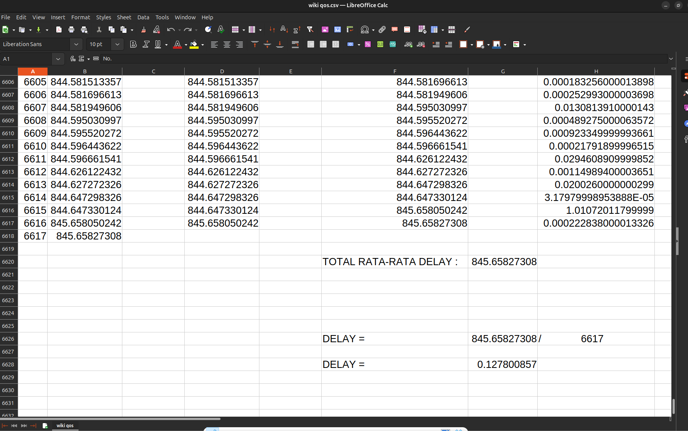
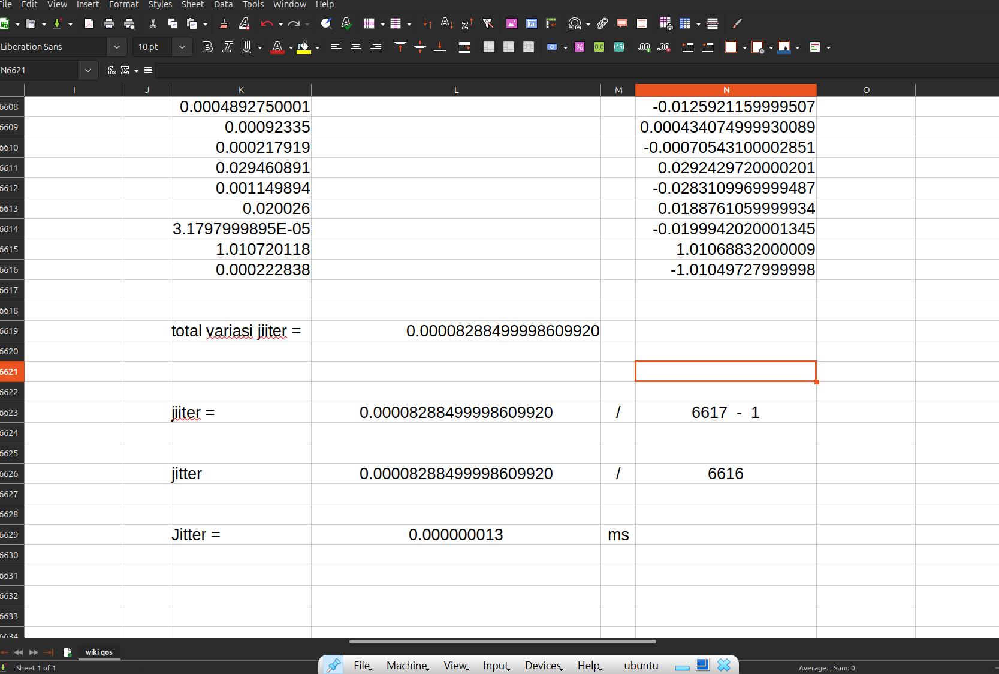

  <table>
        <tr>
            <th>Nama</th>
            <td>: yasyir masy'al</td>
        </tr>
        <tr>
            <th>Kelas</th>
            <td>: Tk 4 B</td>
        </tr>
        <tr>
            <th>Nim</th>
            <td>: 09030282327049</td>
        </tr>
    </table>

<h1 style="font-weight: bold;">
ANALISIS JARINGAN MENGGUNAKAN WIRESHARK
</h1 >
 

<h2 style="font-weight: bold;">
 Pendahuluan
</h2 >

Wireshark adalah perangkat lunak open-source yang digunakan untuk menganalisis lalu lintas jaringan. Dengan menggunakan Wireshark, administrator jaringan dapat memantau, menganalisis, dan mengidentifikasi permasalahan jaringan, serta mendeteksi aktivitas mencurigakan.

<h2 style="font-weight: bold;">
Metodologi
</h2 >

<ul>
  <li>
Perangkat Lunak: Wireshark versi terbaru.
  </li>
  <li>
Lingkungan: Jaringan wifi Universitas Sriwijaya.
  </li>
  <li>
Merekam lalu lintas selama 10 menit.
  </li>
  <li>
Menyimpan hasil dalam format .pcap untuk analisis lebih lanjut.
  </li>
  <li>
Meyimpan hasil dengan format CSV, untuk menganalisis perhitunga QOS
  </li>
</ul>

<h2 style="font-weight: bold;">
Pengaplikasian
</h2 >

<ol>
    <li>
  Membuka wireshark dan menjalankan dengan jaringan yang sudah di pilih seperti gambar di bawah
  </li>
  
    <li>
      Lakukan analsis dari data yang ada dengan melihat data dari tabel analisis yang ada wireshark
  </li>
  
    <li>
      Buka tab statistik pada bar
    </li>
  
    <li>
      Klik Capture file Properties, dapat dilihat beberapa component penting untuk perhitungan QOS seperti bites,packets dll
    </li>
  
    <li>
      Import file menjadi CSV untuk melakukan analisis yang lebih mendalam
    </li>
     <li>
      Klik Tab File pada Bar
     </li>
  
    </li>
     <li>
       Klik Export Packet Disection, export to CSV
     </li>
  
     <li>
       Lakukan beberapa perhitungan dengan data yang  ada pada Analisis Propertis tadi
     </li>
  
     <li>
       Untuk mencari delay dan jitter di perlukan analisis tambahan di CSV
     </li>
     <li>
       Lakukan pengkategorian untuk mencari Delay dan Jitter seperti gambar di samping
     </li>
  
     <li>
      Perhitungan untuk mencari Delay
     </li>
  
     <li>
      Perhitungan untuk mencari Jitter
     </li>
  
     <li>
     Perhitungan Lengkap QOS ( Quality of Service )
     </li>
  
   
</ol

 

<h2>Kesimpulan </h2>

  Berdasarkan analisis, lalu lintas jaringan menunjukkan aktivitas normal dengan beberapa anomali yang perlu diperhatikan. Dari segi QoS, jaringan menunjukkan kinerja yang cukup baik dengan beberapa area yang perlu ditingkatkan. Untuk meningkatkan keamanan dan kinerja jaringan, beberapa rekomendasi yang dapat diterapkan antara lain:

<ul>
  <li>
    Menerapkan firewall untuk memblokir lalu lintas mencurigakan.
  </li>
  <li>
    Memantau dan membatasi permintaan DNS yang berlebihan.
  </li>
  <li>
Menggunakan sistem deteksi intrusi (IDS) untuk mengidentifikasi potensi serangan lebih lanjut.
  </li>
  <li>
Mengoptimalkan QoS dengan pengaturan bandwidth dan prioritas lalu lintas jaringan.
  </li>
  <li>
Mengurangi jitter dengan mengimplementasikan traffic shaping dan QoS policies.
  </li>
 
</ul>

